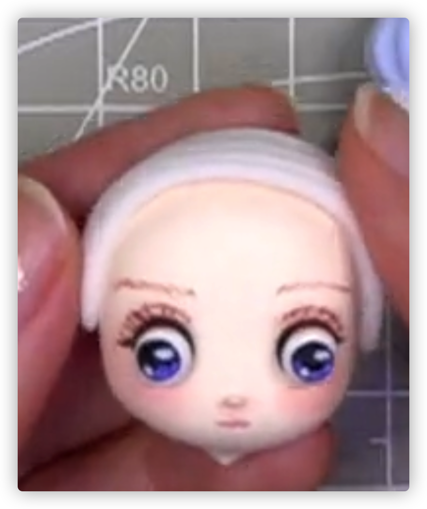

# Tips

- 六寸+黑色卡纸
- 几乎所有东西都要压扁
- 涂金银等颜色的丙烯时，可以淡淡涂一点就是亮晶晶的感觉
- 冷色深色放在后面
- 不要堆厚太多，错开摆放
- 仔细观察整体和各种特征
- 涂色粉垫着纸
- 色粉、亮油等到干彻底了
- 粘土粘板子做背景
- 松树涂金银丙烯涂尖尖
- 色粉可以抹一层浅色的打底
- 先做细的，先做支撑物
- 亮油一个方向涂抹
- 丙烯多加水，少蘸
- 那牙签刮一点丙烯
- 用小丸棒画画
- 丙烯画坏了立即 棉签+水插
- 色粉不要沾水
- 有的泥抹水/护手霜 会变色
- 金色银色丙烯少蘸没啥用...
- 尾巴垫在下面
- 像猫的小脚脚抓抓要贴近主体（胳膊 大腿）的部位压扁
- 背景大片粘土不要把相框侧边包住，不然塞不进去

# 1.月影灵猫

# 2.梦里花开

# 3.雨中漫步

# 4.八方来贺

# 5.狐之夭夭

# 6.星河

 

# 7.花间眠

麻花辫，2个粘在一起

# 8.霓裳

刘海分成3片

# 9.绮丽幻梦

头发：不加颜色的透明白色树脂土

注意麻花头发左右两侧旋转方向不同

# 10. 仙缘

