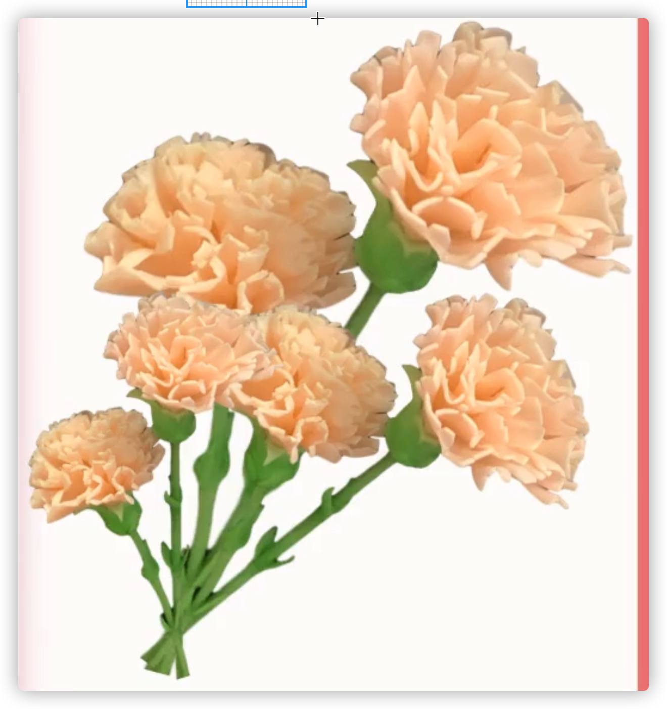

# 技巧

- 可以提前准备一个密封的罩子，里面喷点水保湿，将需要的泥放在里面
- 长胶片，一面贴上胶带，防止手划
- 叠在一起切的时候，倾斜角度

# 萌物

- 肩膀太宽，四肢衔接不自然
- 帽子脑门不凸，要么贴帽边毛绒

# 多肉

- 用木工白乳胶

## 乙女心

粘土永固浅绿

树根熟褐色，挑

## 筒叶花月

粘土树绿

树根熟褐色

根挑

## 红背椒草

树根同叶的红色

顶端看不到根

先对生再环生

刷不晕染，不往回刷

叶根绿色处一点红色

根挑

## 罗琦

根怼横纹

三片轮生

叶子除了第一层后面的别太肥

## 石莲

层数个数3，3，6，6

根推+挑

叶细长点

2色：底色：树绿+群青；大红+群青

小尖在中间，压扁，棒擀

叶片根部要粗一点不然容易插铁丝插破

根：熟褐色

根怼横纹+挑口

## 特玉莲

- 蓝色：群青后面刷白 or 绿底色+刷白色+刷红色 or 绿底色+刷白色+刷绿色渐变 or 底色粉红+刷白
- 三片轮生
- 根：褐色+怼+挑

# 花

- 花瓣叶片边缘抹薄

## 康乃馨

- 花枝用最粗的铁丝
- 建议倒挂
- 树绿泥+颜料

## 郁金香

- 叶子2片就行

